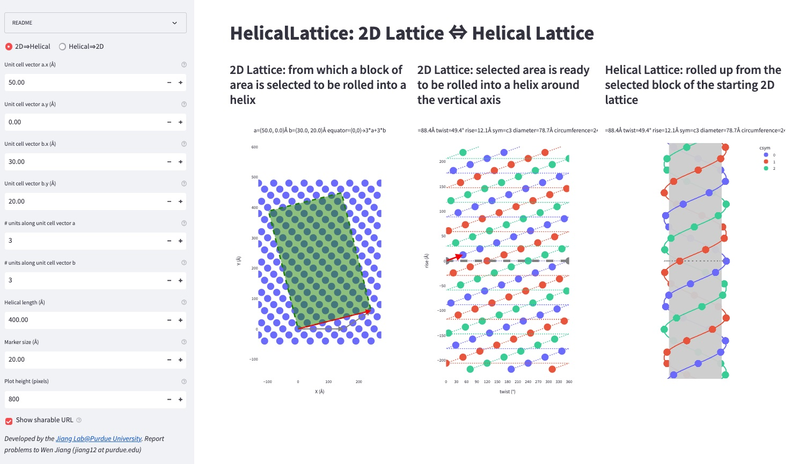

# HelicalLattice: 2D lattice ⇔ helical lattice
**HelicalLattice** is a Web app that helps the user to understand how a helical lattice and its underlying 2D lattice can interconvert. The user can specify any 2D lattice and choose a line segment connecting any pair of lattice points that defines the block of 2D lattice to be rolled up into a helical lattice.

No software installation is needed. Just [click me](https://helical-lattice.streamlitapp.com) to build your helical lattice!</a>

